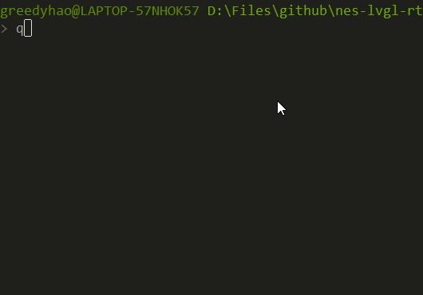

# nes-lvgl-rtt

detail of this project show as below:
+ MCU: stm32f767
+ RTOS: [RT-Thread](https://github.com/RT-Thread/rt-thread)
+ GUI: [LittlevGL](https://github.com/littlevgl/lvgl)

This project has so much problems. Some of them show as below:
+ The screen resolution doesn't fit.
+ The code(bsp\stm32\stm32f767-fire-challenger\packages\nes-old) style is terrible.
+ The game has no controls and without sounds.
+ The picture trembled slightly.

## User guide

### Linux user
Refer to the content of this [link](https://github.com/RT-Thread/env).

### Windows user
download [ENV](https://drive.google.com/open?id=1oOEl1puQY2k9tS5A8Zw0qP2yFmQ0_9oU) 

both env_released_1.0.0.zip or env_released_1.0.0.7z is ok.

Notice that git is needed. You can download git from https://git-scm.com/downloads.

#### how to use env

Unpack the env_released_1.0.0 to the place you want to install the ENV. Here two way to use ENV.

**Method 1**: Click on the executable file under the env directory

Double-click to open the env.exe. If the opening fails, you can try to use env.bat

**Method 2**: Open the env console from the right-click menu in the folder

There is an image of add_env_to_right-click_menu.png in the env directory. Follow the steps in the image to launch the env console from the right-click menu in any folder

#### run this project

Enter into bsp\qemu-vexpress-a9, right-click and select **ConEmu Here**.

Terminal input:

```
qemu.bat
```

Results the following:



----

这个项目的部分信息如下:
+ MCU: stm32f767
+ RTOS: [RT-Thread](https://github.com/RT-Thread/rt-thread)
+ GUI: [LittlevGL](https://github.com/littlevgl/lvgl)

这个项目有太多的问题，其中一部分如下
+ 屏幕分辨率没有适配
+ 代码(bsp\stm32\stm32f767-fire-challenger\packages\nes-old)风格很糟糕
+ 游戏没有控制功能而且没有声音
+ 画面有轻微的抖动

## 如何使用本项目
本项目原本基于stm32f767，考虑到其他人可能并没有响应的开发板，现使用rt-thread提供的qemu仿真

首先需要安装env环境，中文用户请转移到[官方文档](https://www.rt-thread.org/document/site/rtthread-development-guide/rtthread-tool-manual/env/env-user-manual/)查看介绍

进入bsp\qemu-vexpress-a9，右键选择env在此处打开

输入

```
qemu.bat
```

即可看到效果

